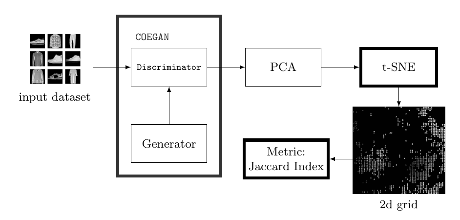
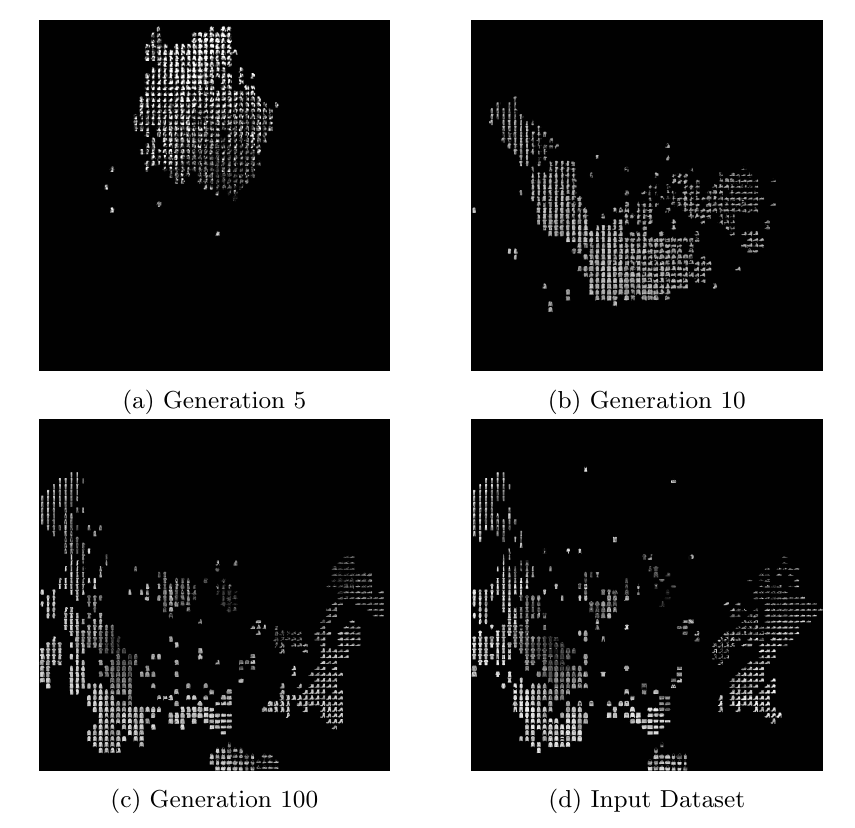
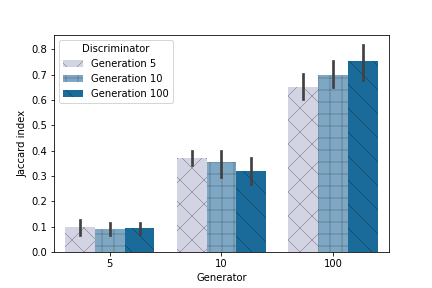

# Gen TSNE: Visualization and Metric for generative models

[](https://github.com/vfcosta/gen-tsne/actions/workflows/ci.yml)

## Introduction

This repository contains the implementation of the valuation method proposed in the paper [Demonstrating the Evolution of GANs through t-SNE](https://link.springer.com/chapter/10.1007/978-3-030-72699-7_39).

See below an overview of the evaluation method:



We applied this method in [COEGAN](https://github.com/vfcosta/coegan) to provide further evidence of the evolutionary contribution of the model to the creation of strong generators and discriminators.

See below some results:


A metric based on the Jaccard index between t-SNE maps was designed to quantitatively represent the aspects of the model.

See below the results of the Jaccard index applied in experiments with COEGAN in the MNIST dataset:



## Instructions

First, put images from the dataset and from generative models into different folders.

Then, start the process with the following command:
```
python main.py -b <DATASET IMAGES> -p <IMAGES FROM MODEL 1> -p <IMAGES FROM MODEL 2>
```

Execute `python main.py --help` to see more options.

If you want to use features instead of image pixels in the grid calculation (`-f` argument), the directory should follow the same structure used in [test/assets/dataset](/test/assets/dataset) and [test/assets/model_a](/test/assets/model_a), i.e. store `.npz` (or `.npy`) files with the same name as each image that you want to evaluate.
